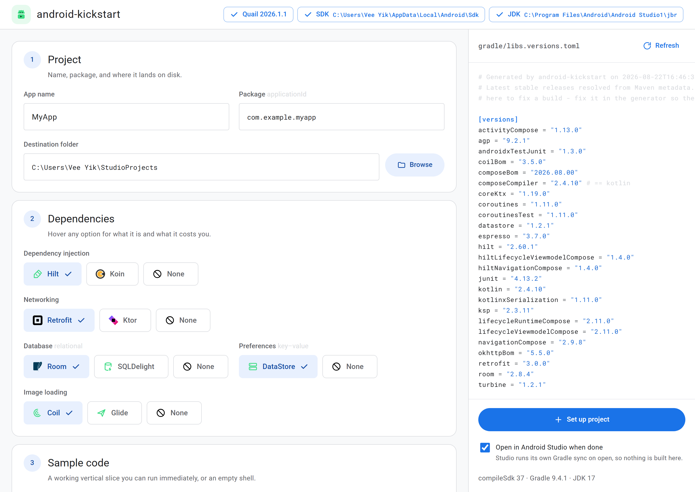

<div align="center">


# android-kickstart

**Pulls the latest Android dependencies and kickstarts a project in seconds.**

</div>



## What it does

- Looks up the current version of every library, live from Maven. No copying numbers out of blog posts.
- Caps the Android Gradle Plugin to what your installed Android Studio can actually open.
- Builds the project before handing it over, so you know the versions work together.
- Gives you a real app, not an empty folder: login screen, home screen, DI, tests.

Pick your stack, press a button, get a project that runs.

## Install

You need [Node 18+](https://nodejs.org).

```bash
git clone https://github.com/vypong/android-kickstart.git
cd android-kickstart
npm link
```

Works on macOS, Windows and Linux.

## Use it

**GUI**

```bash
android-kickstart
```

That is it. Opens in your browser. Choose your options, watch the version catalog update live, press
**Set up project**. It writes the files and opens them in Android Studio.

**Terminal, if you prefer**

```bash
android-kickstart --interactive
```

Asks you the same questions. Or say it all at once, which is what CI does:

```bash
android-kickstart --yes --build --open --name=MyApp --di=hilt --db=room
```

Handy commands:

```bash
android-kickstart help              # all flags, with examples
android-kickstart --dry-run --yes   # show the versions, write nothing
android-kickstart --list-studios    # which Studio opens which AGP
android-kickstart --info=koin       # what a library is, and its trade-offs
```

## Options

| | Choices |
|---|---|
| Dependency injection | Hilt, Koin, none |
| Networking | Retrofit, Ktor, none |
| Database | Room, SQLDelight, none |
| Preferences | DataStore, none |
| Image loading | Coil, Glide, none |
| Sample code | include, or an empty shell |

Everything depends on an interface, so swapping one later is a small change.

## What you get

```
domain/   models and repository interfaces, no Android imports
data/     local, preferences, remote, repository implementations
ui/       login, home, navigation, theme
di/       Hilt modules, a Koin module, or a plain ServiceLocator
test/     fakes and ViewModel tests
```

A login screen with validation and error states leads to a home screen. Auth goes through an
`AuthRepository` with a stub sign-in. Replace the body of `signIn` with your backend and
nothing above it changes.

Also included: an `Application` class wired into the manifest, type-safe navigation routes,
immutable UI state, `@Preview` composables, a version catalog using BOMs and bundles, and
unit tests that pass.

## Why "just take the newest version" does not work

Every one of these is real, and each is handled:

| Trap | Reality |
|---|---|
| The `<release>` field in Maven metadata | Kotlin's currently points at a release candidate |
| Taking the last version listed | AGP's last four are alphas and release candidates |
| Sorting as SemVer | Compose BOM uses calendar versions like `2026.08.00` |
| Sorting as text | Ranks `2.8.4` above `2.8.10` |
| Checking one repository | Hilt is on Maven Central only |
| Trusting the first repo that answers | Google Maven serves a KSP plugin marker frozen in 2021 |
| Assuming a plugin matches its library | kotlinx-serialization's plugin tracks the Kotlin compiler |
| Reading compileSdk from AGP | Current AndroidX needs a newer platform than AGP ships with |

Two things have no machine-readable source at all, so the tool warns instead of guessing: the
AGP to Gradle to JDK floors, and Kotlin to KSP pairing. Only a real build settles those, which
is what `--build` is for.

## Tests

```bash
npm test        # unit tests and config audit, instant
npm run matrix  # 13 combinations, real Gradle builds
```

The full product of all options is 324 builds, so the matrix uses all-pairs coverage instead:
13 projects where every pair of options appears together at least once. It fails on Kotlin
warnings as well as errors, because a deprecation today is a compile error later.

CI runs on Ubuntu, macOS and Windows on every push.

## Licence

MIT, see [LICENSE](LICENSE). Third-party marks are credited in [NOTICE.md](NOTICE.md).
Not affiliated with Google.
